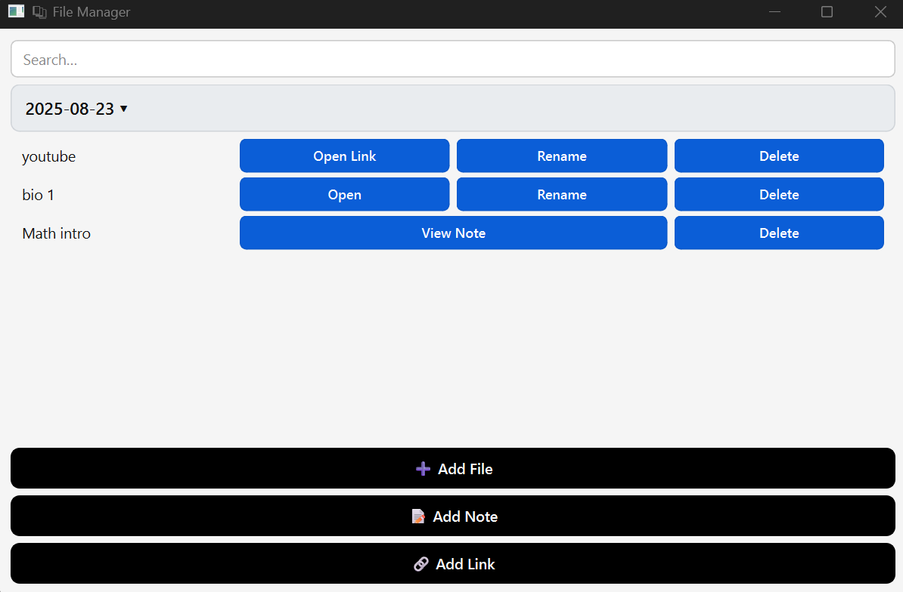

<strong>This app is 100% Python.</strong> 
Visit The Official Site To Download It: <a href="https://x2dat.github.io/File-Manager/">https://x2dat.github.io/File-Manager/</a>

<pre>
--------------------------------------------------------------------------------------------------------------------------------------
| How to install:                                                                                                                    |
| 1- Create a new folder anywhere in your laptop other than C:\Program Files\ OR any place named program files.                      |
| 2- Visit: https://x2dat.github.io/File-Manager/ and click on the "Download For Windows button".                                    |
| 3- When the downloading promt pops-up, slect the folder that you created before and install it there.                              |
| 4- Open the file (exeversion ; you are free to change the name) and add/create any file/note.                                      |
| 5- You will notice that in your folder, a new file named "file_date.json" was created: DO NOT DELETE IT, it needs to stay there!!! |
| 6- If the app was successfully downloaded, everything should run fine. (You don't need wifi to use the app)                        |
--------------------------------------------------------------------------------------------------------------------------------------
</pre>

### New look:

### App Informations:
- Add Files  
- Add Links  
- Create Notes  
- Modify any of them  
- Open Created Links (ex: link → opens your default navigator)  
- Open Created Files (ex: Files → prompt inside the python app)  
- Open Created Notes (ex: Notes → prompt inside the python app)  
- Each Files, Notes And Links Are Stored By Day (ex: 2025-08-22 | Math class 03 ; 2025-08-23 | Bio organic class 02 and English book)  
- Everything Is Stored On **YOUR** Device Via A .json File ; If You Modify The File You Could Corrupt The App And Lose All Your Information  
- No BS, The App Is Simple And Easy To Understand  
- The App Is So Light Your Device Won’t Be Affected By It (only if you have years of information saved or if your device is old)

### Informations:
- 2025-08-22 | This is only the beta version, evrything works, but you wont have much detail and the UI is pretty basic
- 2025-08-23 | V2 is out ; PyQt6 -> better UI but file is 4 times bigger (but still 34mb isn't alot - 9mb to 34mb)
